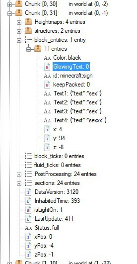

# Spelunk

CTF: buckeye2022
Category: misc
Difficulty: Medium
Solved by: Srdnlen {Salvatore Castello}

# Description

---

# Solution

---

The downloaded file contains a folder "World". within it various subfolders on playerdata, stats etc.
To understand what it is I open the icon, this reminds me a Minecraft world directory.

This can be seen as the structure is identical to any new world created on minecraft.

I found a tool that allows you to analyze the chuncks of a minecraft world, because my intuition is that there was a sign with the flag written somewhere in the world.
Going to find the sign "on foot" was almost impossible: the world had a very high number of chunks.

I tried to create a world on my minecraft to see how a text was inserted into a sign and his attributes, having this result:

Then the text was separated into 4 different strings through the attribute Text1,Text2,Text3 and Text4.
Once you have launched the tool, open the world and search the region folder, with the NAME field enabled and write "text" looking for a "sign" entity (”id: minecraft:sign”), but in this particular case I only used the checkbox “NAME” writing “text”.

The calculation takes several minutes being the amount of chunks very high.
The first result made me a little depressed from the moment I imagined that there would be many signs placed for the world like the one below:

But luckily after a few seconds I found the sign I was looking for with the flag inside :D.

So the flag was: buckeye{700_m4ny_chunk5_70_5p31unk}.

If the road sign does not bring any results you have to see the Chunk from above with Amulet/mcedit (beware mcedit does not seem to work any more than a certain version of MC) to see if there is some gigantographic writing in the ground.

# Links and tools

---

Minecraft (Used only for experiments, not strictly required).

NBTExplorer - { https://github.com/jaquadro/NBTExplorer }.
