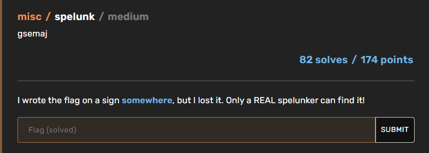

# Spelunk

CTF: buckeye2022
Category: misc
Creation Time: November 11, 2022 12:33 PM
Difficulty: Easy-Medium
Last Edited: November 11, 2022 12:52 PM
Solved by: Anonymous

# Description

---

# Solution

---

The downloaded file contains a folder "World". within it various subfolders on playerdata, stats etc.
To understand what it is I open the icon, this reminds me a Minecraft world directory.

This can be seen as the structure is identical to any new world created on minecraft.

I found a tool that allows you to analyze the chuncks of a minecraft world, because my intuition is that there was a sign with the flag written somewhere in the world.
Going to find the sign "on foot" was almost impossible: the world had a very high number of chunks.

Once you have downloaded the tool, open the world and search the region folder, with the NAME field enabled and write "text" looking for a "sign" entity (”id: minecraft:sign”), but in this case I only used the checkbox “NAME” writing “text”.

The calculation takes several minutes being the amount of chunks very high, after a first empty sign I was able to find the sign I was looking for with the flag inside.

So the flag was: buckeye{700_m4ny_chunk5_70_5p31unk}.

If the road sign does not bring any results you have to see the Chunk from above with Amulet/mcedit (beware mcedit does not seem to work any more than a certain version of MC) to see if there is some gigantographic writing in the ground.

# Links and tools

---

NBTExplorer
